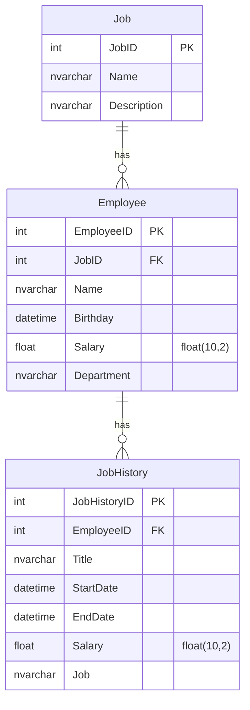

# Projeto API

Este é um projeto de Web API desenvolvido em **Python**, utilizando **FastAPI** e **SQLAlchemy**, com base em um modelo relacional.

## Funcionalidades da API

A API implementa os seguintes verbos (endpoints) para as entidades do modelo:

### Entidade 1: `Job`

1. `GET /api/job` – Lista todos os cargos
2. `POST /api/job` – Cria um novo cargo
3. `GET /api/job/{id}` – Retorna um cargo pelo ID (com funcionários associados)
4. `PUT /api/job/{id}` – Atualiza os dados de um cargo
5. `DELETE /api/job/{id}` – Remove um cargo

### Entidade 2: `Employee`

6. `GET /api/employee` – Lista todos os funcionários
7. `POST /api/employee` – Cria um novo funcionário
8. `GET /api/employee/{id}` – Retorna um funcionário pelo ID (com seu cargo e histórico de cargos)
9. `PUT /api/employee/{id}` – Atualiza os dados de um funcionário
10. `DELETE /api/employee/{id}` – Remove um funcionário

### Entidade 3: `JobHistory`

11. `GET /api/jobhistory` – Lista todo o histórico de cargos
12. `POST /api/jobhistory` – Cria um novo registro de histórico de cargo
13. `GET /api/jobhistory/{id}` – Retorna um registro de histórico pelo ID
14. `PUT /api/jobhistory/{id}` – Atualiza os dados de um histórico de cargo
15. `DELETE /api/jobhistory/{id}` – Remove um registro de histórico de cargo

## Diagrama de Entidades (Mermaid)

Acesse a API em:

- Swagger: http://localhost:8000/docs
- Redoc: http://localhost:8000/redoc
