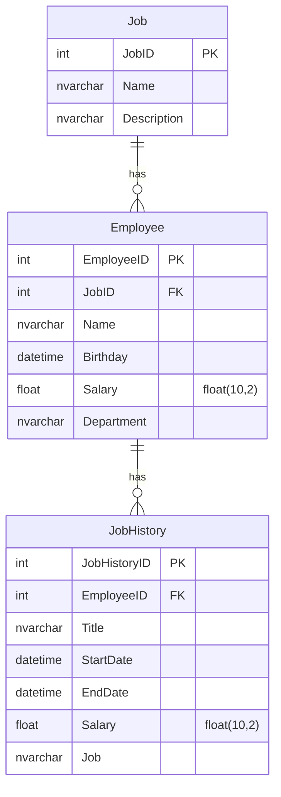

# Projeto API

Este é um projeto de Web API desenvolvido em **Python**, utilizando **FastAPI** e **SQLAlchemy**, com base em um modelo relacional.

## Funcionalidades da API

A API implementa os seguintes verbos (endpoints) para as entidades do modelo:

### Entidade 1: `Aluno`

1. `GET /api/aluno` – Lista todos os alunos
2. `POST /api/aluno` – Cria um novo aluno
3. `GET /api/aluno/{id}` – Retorna um aluno pelo ID (com suas disciplinas e notas)
4. `PUT /api/aluno/{id}` – Atualiza dados de um aluno
5. `DELETE /api/aluno/{id}` – Remove um aluno

### Entidade 2: `Disciplina`

6. `GET /api/disciplina` – Lista todas as disciplinas
7. `POST /api/disciplina` – Cria uma nova disciplina
8. `GET /api/disciplina/{id}` – Retorna uma disciplina pelo ID (com alunos relacionados, se houver)
9. `PUT /api/disciplina/{id}` – Atualiza dados de uma disciplina
10. `DELETE /api/disciplina/{id}` – Remove uma disciplina

### Entidade 3: `Nota`

11. `GET /api/nota` – Lista todas as notas
12. `POST /api/nota` – Cria uma nova nota
13. `GET /api/nota/{id}` – Retorna uma nota pelo ID
14. `PUT /api/nota/{id}` – Atualiza dados de uma nota
15. `DELETE /api/nota/{id}` – Remove uma nota

## Diagrama de Entidades (Mermaid)

Acesse a API em:

- Swagger: http://localhost:8000/docs
- Redoc: http://localhost:8000/redoc
